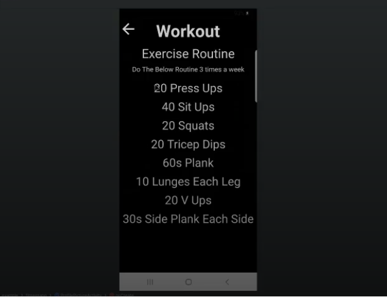

# FitnessApp - Android App

**FitnessApp** is a mobile application developed for Android using **Kotlin** and **Firebase**. This app helps users track their fitness activities, monitor their heart rate, set step goals, and log workouts. It also features live tracking of walks and runs with the Google Maps API.

---

## Key Features

### 1. **User Account Management**
- **Create an Account**: Users can sign up by entering their name, email, password, gender, weight, height, and step goal.
- **Profile Picture**: Users can upload a profile picture from their camera or gallery.
- **Sign-In**: Existing users can log in to their accounts.

---

### 2. **Walks & Runs Tracking**
- **Google Maps Integration**: Track walks and runs with live route mapping using the Google Maps API.
- **Activity Logging**: Routes are saved in Firebase for each user’s runs and walks, providing a history of their activities.

---

### 3. **Step Counter & **Heart Rate Monitoring**** 
- **Step Tracking**: A built-in step counter records steps based on phone movement, helping users track their daily activity.
- **Camera-Based Heart Rate Monitoring**: The app uses the phone's camera to measure the user's heart rate based on the colour of red on their fingertip.
- **Firebase Database**: Heart rate data is stored in Firebase for future reference and analysis.

---

### 4. **Workout Screen**
- A simple workout screen that lists exercises for the user to follow, helping them maintain a healthy fitness routine.

